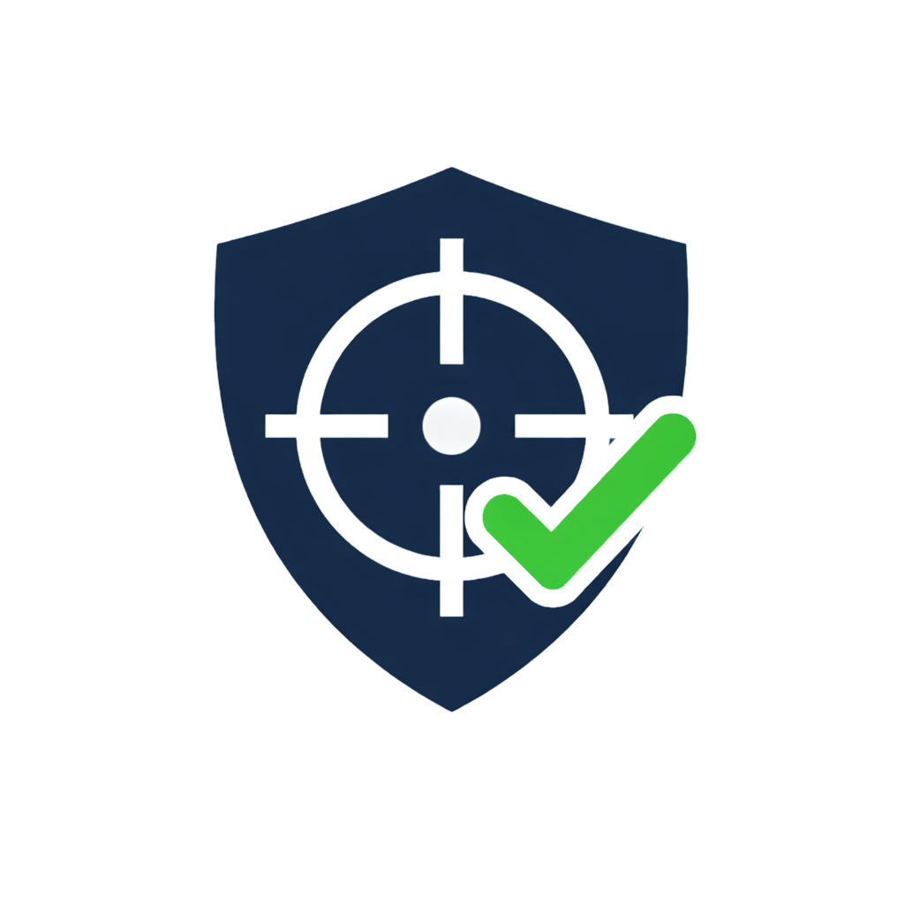

# TracePilot

**Secure First-Piece Inspection & Traceability Copilot**



TracePilot helps CNC operators and quality inspectors perform first-piece inspections with AI-assisted spec extraction, guided measurement workflows, real-time tolerance checking, and audit-ready traceability reports.

---

## Architecture

```
+------------------+      +------------------+      +------------------+
|    Streamlit      | ---> |    FastAPI        | ---> |    SQLite         |
|    Frontend       | <--- |    Backend        | <--- |    Database       |
|    (port 8501)    |      |    (port 8000)    |      |                  |
+------------------+      +--------+---------+      +------------------+
                                    |
                           +--------v---------+
                           |    Ollama         |
                           |  (LLM + Embed)   |
                           |  (port 11434)    |
                           +------------------+
```

**Input:** Job card PDF, engineering drawing PDF, SOP PDF, manual measurements, photo evidence

**AI Pipeline:**
1. PDF text extraction (pdfplumber)
2. LLM-based spec extraction via Ollama (with regex fallback)
3. Human review/edit/confirm of extracted specs
4. Deterministic tolerance checking (rule-based, not LLM)
5. Audit log generation
6. PDF/JSON report generation (ReportLab)

**Output:** Guided inspection UI, pass/fail alerts, supervisor escalation, traceability report pack

---

## Tech Stack

| Layer | Technology |
|-------|-----------|
| Frontend | Streamlit |
| Backend | FastAPI + Uvicorn |
| Database | SQLite + SQLAlchemy |
| LLM | Ollama (llama3.2 + nomic-embed-text) |
| PDF Parsing | pdfplumber |
| PDF Reports | ReportLab |
| Auth | JWT (python-jose) + bcrypt (passlib) |
| Containerization | Docker + docker-compose |

---

## Quick Start (Local)

### Prerequisites
- Python 3.11+
- (Optional) Ollama for LLM extraction
- (Optional) Docker for containerized deployment

### 1. Install dependencies

```bash
cd TracePilot
pip install -r requirements.txt
```

### 2. Generate demo PDFs

```bash
python demo_data/generate_demo_pdf.py
```

### 3. Start the backend

```bash
python -m uvicorn backend.main:app --host 0.0.0.0 --port 8000 --reload
```

### 4. Start the frontend (new terminal)

```bash
streamlit run frontend/app.py
```

### 5. Open in browser

Navigate to **http://localhost:8501**

---

## Quick Start (Docker)

```bash
docker-compose up --build
```

- Frontend: http://localhost:8501
- Backend API: http://localhost:8000
- API Docs: http://localhost:8000/docs

---

## Demo Credentials

| Role | Username | Password |
|------|----------|----------|
| Operator | `operator` | `operator123` |
| Supervisor | `supervisor` | `supervisor123` |
| Admin | `admin` | `admin123` |

---

## Demo Walkthrough

### Happy Path (5-minute demo)

1. **Login** as `operator` / `operator123`
2. **Create a new job** -- title: "Precision Shaft FPI", sensitivity: Confidential
3. **Upload** the 3 demo PDFs from `demo_data/`
4. **Extract specs** -- click "Extract Specs & Steps" (uses regex fallback if Ollama is not running)
5. **Review & edit** extracted specifications -- delete false positives, adjust values
6. **Confirm all specs** to begin inspection
7. **Enter measurements** for each spec:
   - Enter a value within tolerance to see PASS (green)
   - Enter an out-of-tolerance value to see FAIL (red) and auto-deviation creation
8. **Switch to supervisor** -- log out, log in as `supervisor` / `supervisor123`
9. **Review deviations** -- approve/reject with notes
10. **Generate report** -- creates PDF and JSON traceability pack
11. **View audit log** -- log in as `admin` / `admin123`, check Audit Log page

### Demo Data

The `demo_data/` folder contains:
- `demo_job_card.pdf` -- Job traveler with part info
- `demo_engineering_drawing.pdf` -- Engineering drawing with dimension callouts
- `demo_sop.pdf` -- Standard operating procedure
- `sample_specs.json` -- 5 critical specs (one tight tolerance for demo fail)
- `sample_steps.json` -- 7 inspection steps
- `sample_job_card.json` -- Part metadata

---

## Project Structure

```
TracePilot/
+-- backend/
|   +-- __init__.py
|   +-- main.py              # FastAPI app entry point
|   +-- config.py             # Settings (pydantic-settings)
|   +-- database.py           # SQLAlchemy setup
|   +-- models.py             # ORM models (11 tables)
|   +-- schemas.py            # Pydantic request/response schemas
|   +-- auth.py               # JWT + password hashing + RBAC
|   +-- audit.py              # Audit log utility
|   +-- seed.py               # Demo user seeder
|   +-- routers/
|       +-- auth_routes.py    # Login, user info
|       +-- job_routes.py     # Job CRUD
|       +-- document_routes.py # PDF upload/download
|       +-- extraction_routes.py # AI spec extraction + CRUD
|       +-- inspection_routes.py # Measurement + tolerance check
|       +-- deviation_routes.py  # Deviation management
|       +-- report_routes.py   # PDF/JSON report generation
|       +-- audit_routes.py    # Audit log queries
+-- frontend/
|   +-- app.py                # Streamlit main app
|   +-- api_client.py         # Backend API wrapper
|   +-- pages/
|       +-- login.py
|       +-- dashboard.py
|       +-- new_job.py
|       +-- inspection.py
|       +-- deviation_review.py
|       +-- audit_log.py
+-- demo_data/
|   +-- generate_demo_pdf.py
|   +-- demo_job_card.pdf
|   +-- demo_engineering_drawing.pdf
|   +-- demo_sop.pdf
|   +-- sample_specs.json
|   +-- sample_steps.json
|   +-- sample_job_card.json
+-- tests/
|   +-- test_tolerance.py     # Tolerance engine tests
|   +-- test_auth.py          # Auth utility tests
|   +-- test_audit.py         # Audit log tests
+-- requirements.txt
+-- docker-compose.yml
+-- Dockerfile.backend
+-- Dockerfile.frontend
+-- pytest.ini
+-- icon.png
```

---

## Data Models

| Model | Purpose |
|-------|---------|
| User | Operators, supervisors, admins with role-based access |
| Job | Inspection job with status tracking and sensitivity label |
| Document | Uploaded PDF files linked to jobs |
| CriticalSpec | Extracted/confirmed dimensional specifications |
| InspectionStep | Guided inspection workflow steps |
| MeasurementEntry | Recorded measurements with pass/fail status |
| Deviation | Out-of-tolerance events requiring review |
| Approval | Supervisor disposition records |
| AuditLog | Immutable action log for traceability |
| ReportBundle | Generated PDF/JSON report references |

---

## API Endpoints

| Method | Path | Description |
|--------|------|-------------|
| POST | `/api/auth/login` | Authenticate, get JWT |
| GET | `/api/auth/me` | Current user info |
| POST | `/api/jobs/` | Create job |
| GET | `/api/jobs/` | List jobs |
| GET | `/api/jobs/{id}` | Job detail |
| POST | `/api/documents/upload/{job_id}` | Upload PDFs |
| POST | `/api/extraction/{job_id}/extract` | Run AI extraction |
| GET | `/api/extraction/{job_id}/specs` | List specs |
| POST | `/api/extraction/{job_id}/confirm` | Confirm all specs |
| POST | `/api/inspection/measure` | Submit measurement |
| GET | `/api/inspection/{job_id}/progress` | Inspection progress |
| GET | `/api/deviations/{job_id}` | List deviations |
| POST | `/api/deviations/{id}/approve` | Approve deviation |
| POST | `/api/reports/{job_id}/generate` | Generate report |
| GET | `/api/audit/` | Audit logs (admin) |

Full API docs at: http://localhost:8000/docs

---

## Testing

```bash
python -m pytest tests/ -v
```

**18 tests covering:**
- Tolerance engine (6 tests): pass, fail, boundary, nominal
- Authentication (7 tests): hashing, JWT, roles
- Audit logging (5 tests): creation, persistence, system actions

---

## Security Features

- JWT-based authentication with bcrypt password hashing
- Role-based access control (operator/supervisor/admin)
- Sensitivity labels on every job (General/Confidential/Highly Confidential)
- Immutable audit log for all actions
- Local-first design -- no cloud dependency for core workflow
- PDF validation on upload (only .pdf files accepted)

---

## Key Design Decisions

1. **Deterministic tolerance checking** -- Pass/fail is computed with simple `lower <= actual <= upper`, not by LLM. This ensures reliability.
2. **Mandatory human review** -- Extracted specs must be confirmed by the user before inspection begins. No full automation.
3. **Regex fallback** -- If Ollama is unavailable, the system falls back to regex-based dimension extraction, ensuring the app works offline.
4. **Source provenance** -- Every extracted spec carries its source document, page, and text snippet.
5. **Audit everything** -- Login, upload, extraction, confirmation, measurement, approval, and report generation are all logged.

---

## License

Hackathon prototype -- not for production use.
